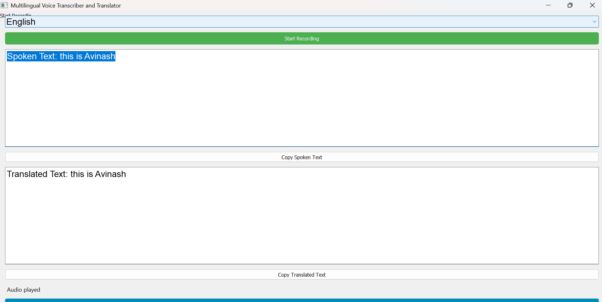
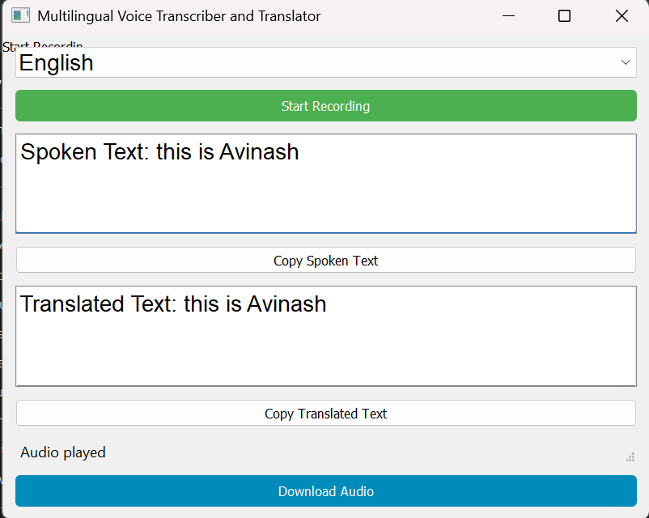

# 🎙️ Multilingual Voice Transcriber and Translator

A multilingual voice transcriber and translator built with **PyQt5**, **gTTS**, and **speech_recognition**, enabling real-time speech transcription, translation, and voice playback across multiple languages.

---

## 🖼️ UI Screenshots

### 🔹 Application UI


### 🔹 Start Recording Button


### 🔹 Translated Output


---

## 📚 Table of Contents

- [Problem Statement](#problem-statement)
- [Features](#features)
- [Installation](#installation)
- [Usage](#usage)
- [License](#license)
- [Note](#note)

---

## ❓ Problem Statement

In our increasingly globalized world, **language barriers** can pose significant challenges. This project aims to address that need by enabling:

> 🔁 Voice ➝ Transcription ➝ Translation ➝ Text-to-Speech

The application listens to spoken language, converts it to text, translates it into a target language, and finally speaks the translated output aloud — enabling seamless multilingual communication.

---

## ✨ Features

- 🎤 **Voice Transcription**  
  Transcribes spoken language into text using Google's `speech_recognition`.

- 🌐 **Translation**  
  Converts transcribed text into multiple languages using the `translate` library.

- 🔊 **Text-to-Speech (TTS)**  
  Uses Google Text-to-Speech (`gTTS`) to convert translated text into audio output.

- 💾 **Download MP3**  
  Download the translated speech as an `.mp3` audio file.

- 📋 **Copy Text**  
  Easily copy both transcribed and translated text to the clipboard.

---

## ⚙️ Installation

> _Tested with **Python 3.12.2**_

1. **Clone the repository**:
   ```bash
   git clone https://github.com/AbinashAdithya/Multilingual-Voice-Transcriber-and-Translator.git
   cd Multilingual-Voice-Transcriber-and-Translator
